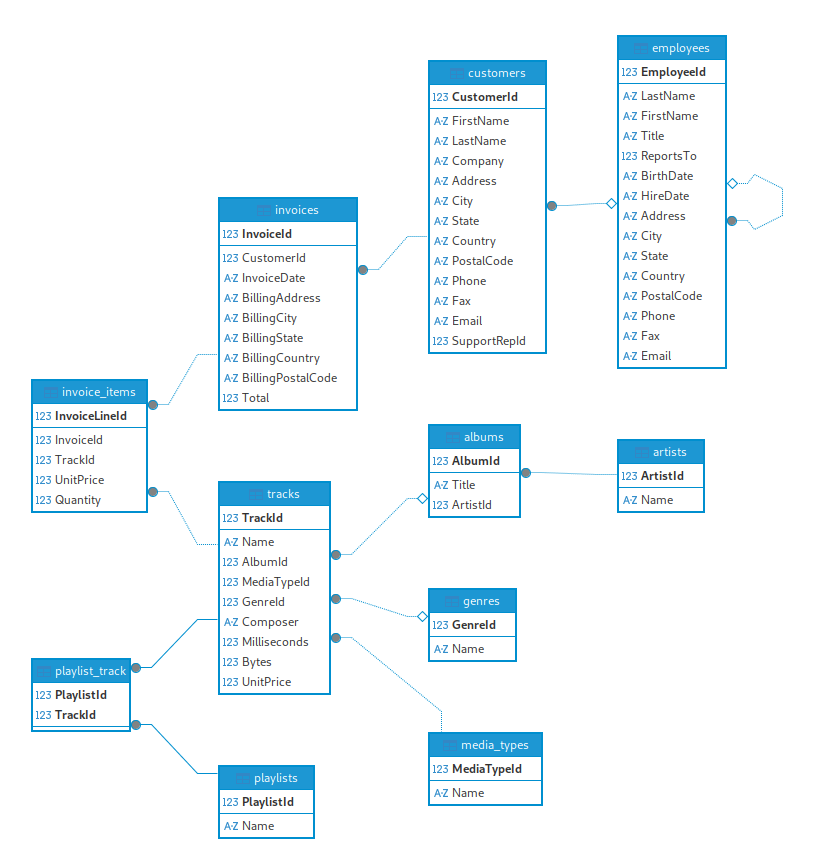

# Testing SQLite on a Large Dataset


To build a large database, the sample [`Chinook` database](https://www.sqlitetutorial.net/wp-content/uploads/2018/03/chinook.zip) from the [SQLite tutorial](https://www.sqlitetutorial.net) was used.





The `customers` table was constantly filled with relatively large rows, until the table has reached `1115397` rows and the DB size has grown to `80_106_637_312` bytes.

The `first name` and `last name` are generated as a string concatenation: `{id}customer_name{id}` and `{id}customer_last_name{id}`, so that all names are unique.


## Benchmarks

Test                  | Cycles cost (first run)  | Cycles cost (second run)
----------------------|--------------------------|----------------------------------
Count elements on the first call: `SELECT COUNT(*) FROM customers`                  | 12392402159  |  6205886
Customer search by row ID: `SELECT firstname, lastname, email WHERE customer_id=900000` | 36316014  |   84516
Select by the indexed field first name by the exact match: `SELECT firstname, lastname, email FROM customers WHERE firstname = "2912169customer_name2912169"` | 33252345  |  62988
Select by first name, that does not exist: `SELECT firstname, lastname, email FROM customers WHERE firstname = "1"` | 30067131  |  60316
Customer search by row ID: `SELECT firstname, lastname, email FROM customers WHERE customerid>900000 and customerid<900050` | 63839343  |  1821716
Customer count depending on the `first name`: `SELECT count(*) FROM customers WHERE firstname>="1" and firstname<"2"` | 6498875034  |  254846762
Select a person that doesn't exist using `LIKE`: `SELECT firstname, lastname, email FROM customers WHERE firstname LIKE "a%"` | Failed
Select a person using `OFFSET`: `SELECT firstname, lastname, email FROM customers WHERE firstname LIKE "a%"` | Failed


```admonish note
**Note:** Both failing queries require full table scan, and SQLite is not able to process that amount within estimated time, you can check if a query is going for a full scan by prepending `EXPLAIN QUERY PLAN` to your query:

`EXPLAIN QUERY PLAN SELECT firstname, lastname, email FROM customers LIMIT 5 OFFSET 900000`
```

This test shows that it is possible to create a very large database, it is however, not as optimal as one might expect. On a large database some operations will always fail because they would require too many cycles. The exact limit on the database size may depend on many aspects such as the page size, the row size and number, and the table structure. The actual "practial" database size might be in range from 2GiB to 20GiB, which might be enough in the majority of usecases.


## Reproducing the Benchmarks

Check out the Benchmark repository [ic-chinook-base](https://github.com/wasm-forge/benchmarks/tree/main/ic-chinook-base) if you wish to repeat or examine the experiment. 
